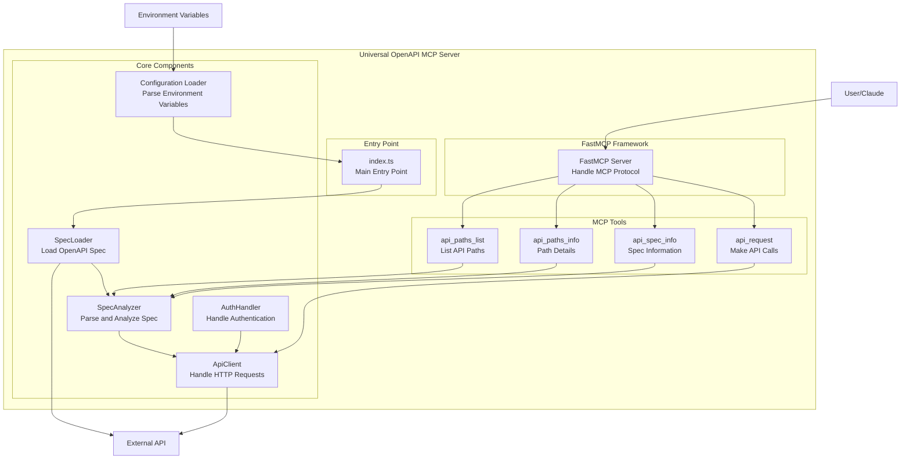
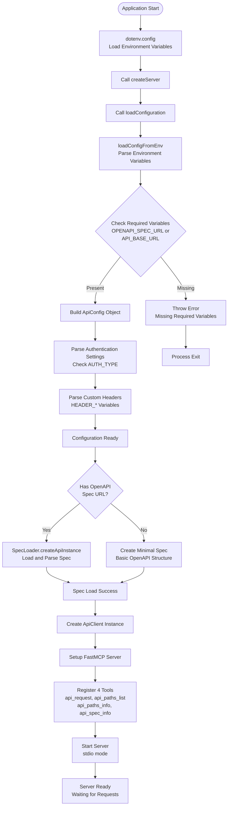
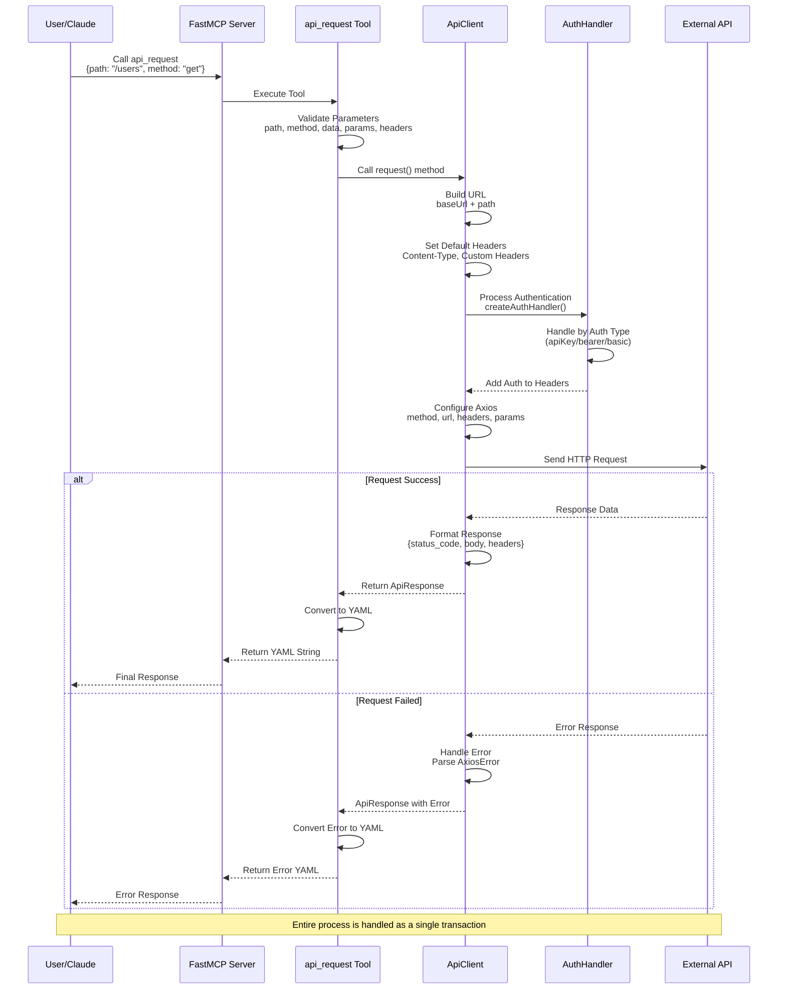
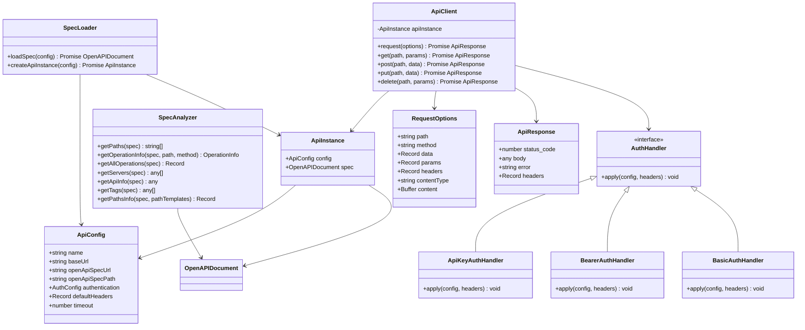
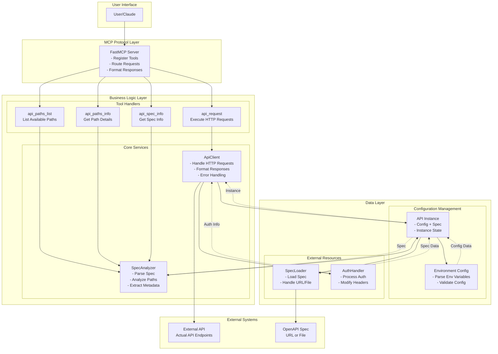
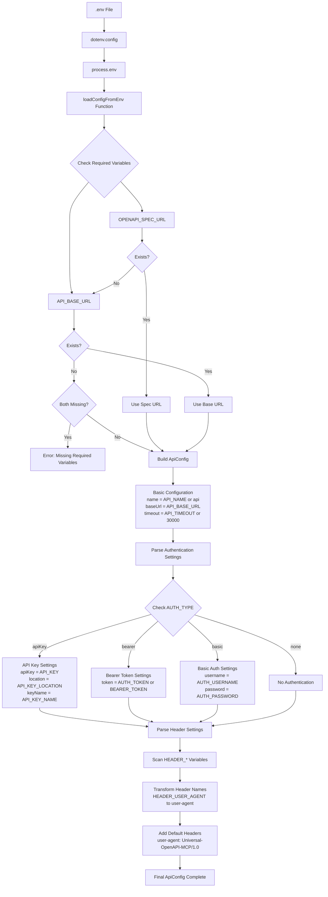
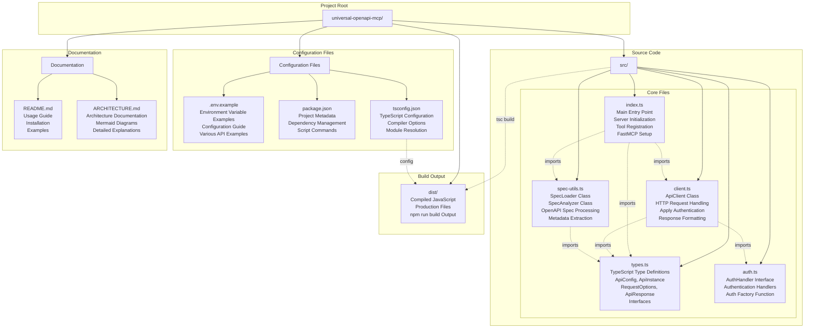

# Universal OpenAPI MCP Server - Architecture Documentation

## Table of Contents
1. [Overall Architecture](#overall-architecture)
2. [Initialization Flow](#initialization-flow)
3. [API Request Processing Flow](#api-request-processing-flow)
4. [Class Structure](#class-structure)
5. [Component Interactions](#component-interactions)
6. [Environment Variable Configuration Flow](#environment-variable-configuration-flow)
7. [Authentication Processing Flow](#authentication-processing-flow)
8. [File Structure and Roles](#file-structure-and-roles)

---

## Overall Architecture



---

## Initialization Flow

Shows the initialization process when the application starts.



---

## API Request Processing Flow

Shows the processing flow when a user calls the `api_request` tool.



---

## Class Structure

Shows the main classes and their relationships in the application.



---

## Component Interactions

Shows how the main components interact with each other.



---

## Environment Variable Configuration Flow

Shows how environment variables are parsed and used.



---

## Authentication Processing Flow

Shows how different authentication methods are processed.

```mermaid
flowchart TD
    Start[HTTP Request Start] --> CreateAuth[Call createAuthHandler]
    CreateAuth --> CheckType{Check Auth Type}
    
    CheckType -->|apiKey| ApiKeyHandler[ApiKeyAuthHandler]
    CheckType -->|bearer| BearerHandler[BearerAuthHandler]
    CheckType -->|basic| BasicHandler[BasicAuthHandler]
    CheckType -->|none| NoAuth[No Authentication]
    
    subgraph "API Key Authentication"
        ApiKeyHandler --> CheckLocation{Check Location}
        CheckLocation -->|header| AddApiKeyHeader[Add to Headers<br/>headers[keyName] = apiKey]
        CheckLocation -->|query| AddApiKeyQuery[Add to Query<br/>params[keyName] = apiKey]
        
        AddApiKeyHeader --> ApiKeyDone[API Key Complete]
        AddApiKeyQuery --> ApiKeyDone
    end
    
    subgraph "Bearer Token Authentication"
        BearerHandler --> AddBearer[Add Authorization Header<br/>Authorization: Bearer token]
        AddBearer --> BearerDone[Bearer Complete]
    end
    
    subgraph "Basic Authentication"
        BasicHandler --> EncodeBasic[Base64 Encode<br/>btoa(username:password)]
        EncodeBasic --> AddBasic[Add Authorization Header<br/>Authorization: Basic encoded]
        AddBasic --> BasicDone[Basic Complete]
    end
    
    ApiKeyDone --> ApplyAuth[Apply Authentication]
    BearerDone --> ApplyAuth
    BasicDone --> ApplyAuth
    NoAuth --> ApplyAuth
    
    ApplyAuth --> RequestReady[Request Ready]
    RequestReady --> SendRequest[Send HTTP Request]
    
    SendRequest --> Success{Response Success?}
    Success -->|Yes| FormatSuccess[Format Success Response<br/>{status_code, body, headers}]
    Success -->|No| FormatError[Format Error Response<br/>{status_code, error, headers}]
    
    FormatSuccess --> End[Complete]
    FormatError --> End
```

---

## File Structure and Roles



---

## Key Concepts

### 1. **MCP (Model Context Protocol)**
- Protocol that allows AI models like Claude to interact with external tools
- FastMCP is a framework that makes it easy to implement this protocol

### 2. **OpenAPI Specification**
- Standardized format for describing REST API structure
- Defines API endpoints, parameters, response formats, etc.

### 3. **Environment Variable Configuration**
- Design that allows connecting to different APIs without code changes
- Separates security information (API keys, etc.) from code

### 4. **Authentication Methods**
- **API Key**: Passed via header or query parameter
- **Bearer Token**: Included in Authorization header
- **Basic Auth**: Username:password encoded in Base64

### 5. **Type Safety**
- Using TypeScript to detect errors at compile time
- Contract definitions through interfaces and types

This architecture follows the **Single Responsibility Principle** and **Dependency Injection** pattern, where each component has a clear role and can be easily tested and extended.
